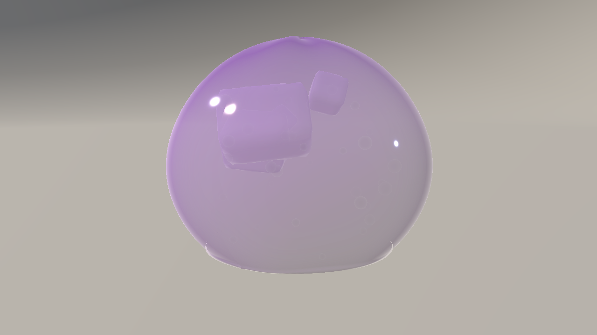
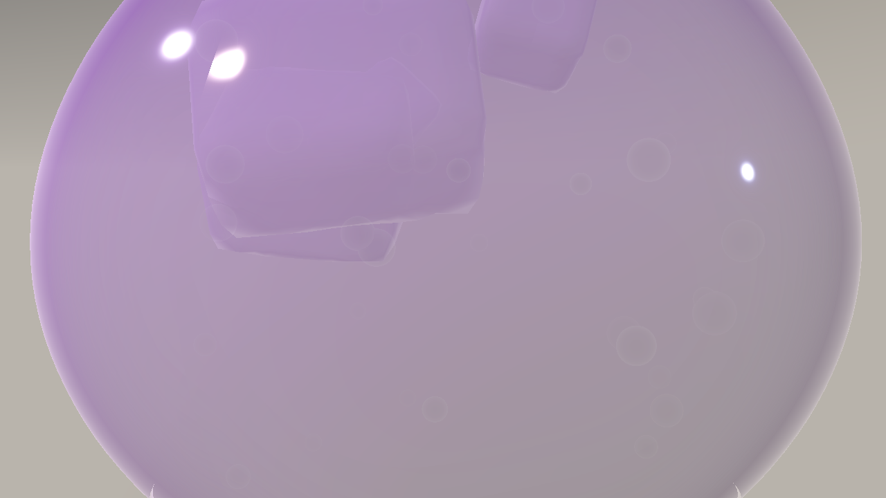
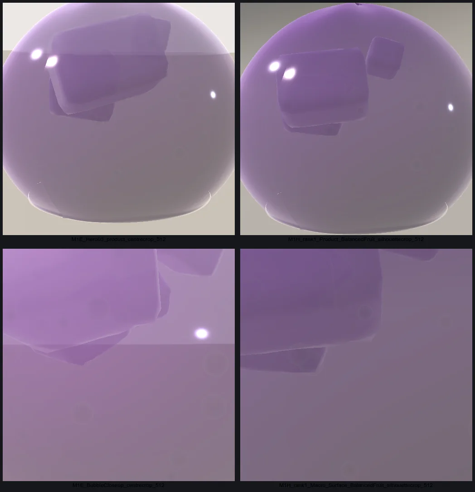
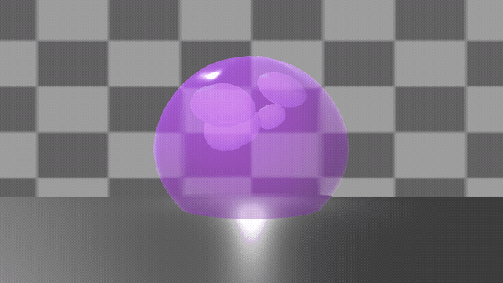
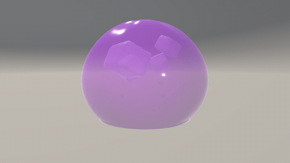
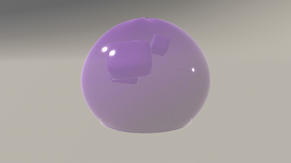
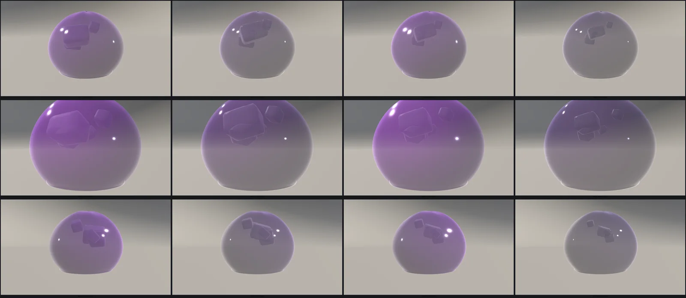
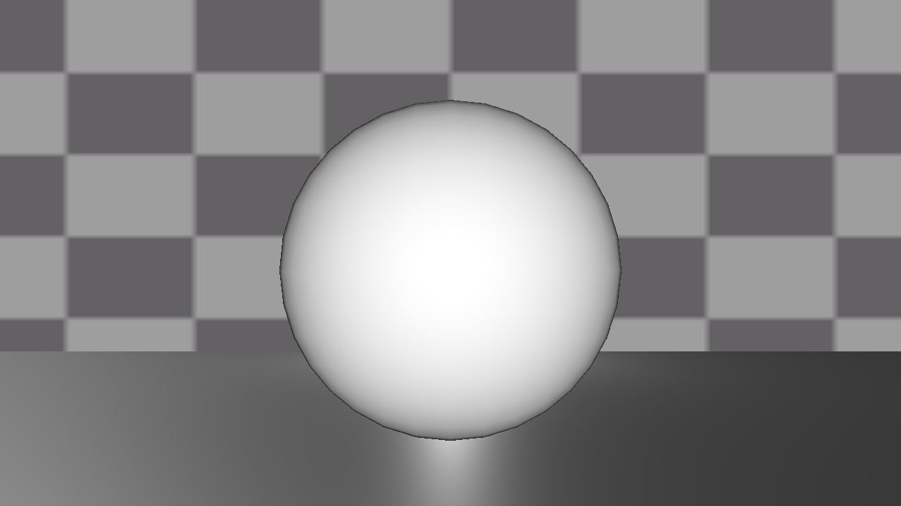
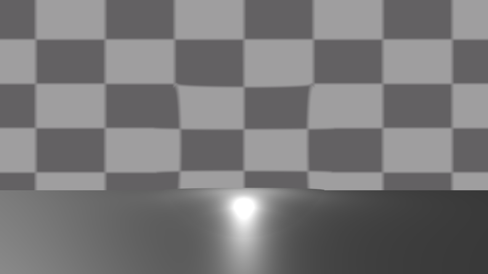
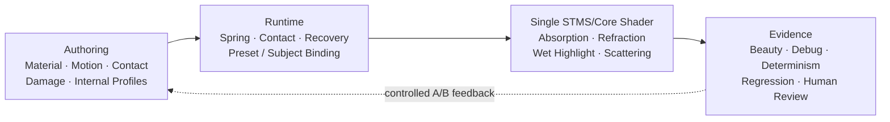

INDEPENDENT TECHNICAL ART RESEARCH · UNITY / TUANJIE · URP

# SOFTMATTER

### A study in light, softness & the urge to touch.

**STMS — Soft Translucent Material System**

One shader core. Multiple material identities. Motion, interaction, and experiments you can inspect.

01 / THE SUBJECT · M1-H Clean Product study · genuine engine-rendered frame · visual selection pending

[Material study](#01--material-study) &nbsp;·&nbsp; [Motion](#02--motion-and-response) &nbsp;·&nbsp; [Four presets](#03--four-material-identities) &nbsp;·&nbsp; [Inside STMS](#04--inside-the-system) &nbsp;·&nbsp; [Research notes](#05--the-honest-research-record)

---

## 01 / Material study

**A convincing jelly needs more than transparency.**

Thickness-dependent colour, absorbed light, a soft rim, wet specular and internal inclusions all have to read together. The real-time pipeline combines an analytic thickness proxy, Beer–Lambert absorption, screen-space refraction, Fresnel and artistic scatter.

<table>
<tr>
<td width="50%" valign="top">

<strong>01.1 &nbsp; Macro / the material under scrutiny</strong>
 Real engine capture. It exposes the current limits: an overly smooth surface, flat bubble rings and pulp that still reads as separate blocks.
</td>
<td width="50%" valign="top">

<strong>01.2 &nbsp; A more considered presentation</strong>
 Matched M1-E / M1-H comparison. Composition and lighting improved — the microstructure itself did not. <a href="media/m1h/m1e-vs-m1h.png">Open original comparison PNG</a>.
</td>
</tr>
</table>

**Optical boundary:** thickness is a convex-body approximation; refraction is screen-space; scattering is an artistic term, not physical subsurface scattering.

## 02 / Motion and response

**Softness becomes believable when it reacts — and remembers.**

Damped spring wobble, contact, damage and recovery are coupled through data-driven profiles and shader deformation. These are recordings of real Unity/Tuanjie render frames, not generated animation.

<table>
<tr>
<td width="50%" align="center" valign="top">
 
<strong>Whole-body wobble</strong> 
The clearest established expression of soft-body motion.
</td>
<td width="50%" align="center" valign="top">
 
<strong>Damage → recovery</strong> 
The loop returns to rest; visible finger pressure still needs a dedicated repair.
</td>
</tr>
</table>

[▶ Living Jelly · Cloud Jelly candidate](media/m1h/living-cloud.mp4) &nbsp;·&nbsp; [▶ Damage / Recovery · full MP4](media/m1h/damage-recovery.mp4)

<strong>Experimental soft fracture / regeneration — view actual animation</strong>

<a href="media/m1h/fracture-regeneration.mp4">Watch the recorded MP4</a>

This is **single-mesh deformation and visual separation**, not a topology split or independent physical pieces. The tear remains visually limited by transparent-shell sorting and an abrupt rupture beat.

## 03 / Four material identities

**One architecture, four personalities.**

Profiles vary absorption, transmission, wet response, motion, bubbles and internal presentation. They share the same STMS core and one controlled camera/light setup.

Balanced Fruit &nbsp;/&nbsp; Clear Konjac &nbsp;/&nbsp; Cloud Jelly &nbsp;/&nbsp; Firm Clear Gel

Above: web-optimized derivative of an actual 5168 × 2250 Unity gallery capture, not AI-generated material art. The original full-resolution source is preserved in the M1-H review archive. Greyscale review showed some identities still resemble each other at Hero distance.

## 04 / Inside the system

<table>
<tr>
<td width="50%" align="center"> Thickness / absorption</td>
<td width="50%" align="center"> Refraction / debug evidence</td>
</tr>
</table>

**Built to be audited:** real deterministic capture sequences, parameter traces, per-process comparisons, per-renderer MaterialPropertyBlocks, and explicit limits rather than unexplained “it works” claims.

[Technical breakdown](docs/technical-overview.md) &nbsp;·&nbsp; [Milestone status](docs/status.md) &nbsp;·&nbsp; [Media provenance](media/m1h/README.md)

## 05 / The honest research record

The latest M1-H pass produced a curated human-review package. It **did not** pass the final-art acceptance target: a beautiful render is not automatically a more physically or visually convincing material.

| Visually established | Still being researched |
|:--|:--|
| Translucent jelly identity, authored looks, damped wobble | Close-up micro-surface detail — 8/8 macro candidates under threshold |
| Continuous captured damage/recovery sequence | Visible local finger dent — 141/150 consecutive pairs identical in the diagnostic |
| Repeatable candidate views and real frame provenance | Pulp/gel integration and bubbles with credible depth |
| Four material profiles on one core | Progressive tear readability; single-pass sorting limitation |

**Separate tracks, no premature claims**

- **M1-H / Jelly** — engineering package and review complete; **final visual approval pending**.
- **M1-I / Next R&D** — proposed study of tactile contact and microstructure, not an implemented release.
- **M2-A / Jellyfish** — independent generalization research in progress; no new approved jellyfish Hero claimed here.
- **Jelly Island × FluidMatter Water** — concept / readiness audit only; integration **not started**.
- **GPU performance** — **UNMEASURED**; no device-FPS claims. Historical regression still has **66 unresolved rendered-file differences**.

[Read the detailed M1-H visual review](docs/m1h-visual-review.md)

---

**STMS / Soft Translucent Material System**

Technical Art · Real-Time Rendering · Materials · Interaction

Evidence-first portfolio showcase. Real engine captures; no fabricated Unity stills or simulated performance claims.

Rendering context: Tuanjie 2022.3.62t16, URP 14.2.0-t1. This public repository publishes selected study images, documentation and captured animations, not the engine source or a licensed SDK.
