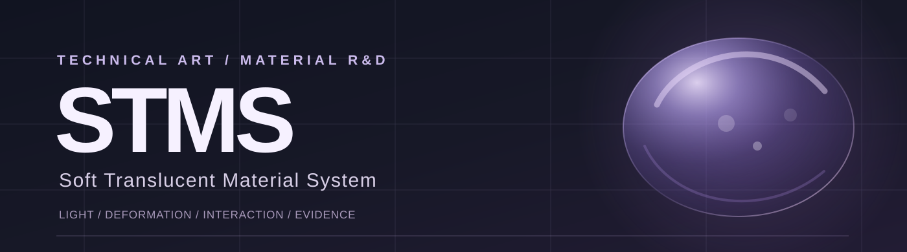

 

SOFTMATTER  /  STMS  /  INDEPENDENT TECHNICAL ART RESEARCH

### Soft bodies deserve more than a transparent shader.

An ongoing real-time material study of **how light travels through soft matter, how it moves, and how it responds to touch.**

UNITY / TUANJIE · URP · SHADER DEVELOPMENT · PROCEDURAL MOTION · MATERIAL AUTHORING

 

[THE JELLY](#01--the-jelly) &nbsp;·&nbsp; [IN MOTION](#02--in-motion) &nbsp;·&nbsp; [FOUR IDENTITIES](#03--one-system-four-identities) &nbsp;·&nbsp; [UNDER THE SURFACE](#04--under-the-surface) &nbsp;·&nbsp; [RESEARCH STATUS](#05--research-status)

---

## 01 / The jelly

*01 — An object you want to touch.*

A purple, translucent study subject: curved optical depth, wet highlights, floating inclusions and a silhouette that responds to motion. The images below are **real Tuanjie/Unity engine captures**, not AI-generated beauty renders.

<table>
<tr>
<td width="62%" valign="top">

 <strong>THE SUBJECT</strong> &nbsp; M1-H / studio capture
 Clean product-view candidate. Final aesthetic approval is pending.
</td>
<td width="38%" valign="top">

 <strong>THE RESPONSE</strong> &nbsp; M1-A / spring motion
 Deformation is part of the material identity, not an added presentation trick.
</td>
</tr>
</table>

BEAUTY FRAME ≠ FINAL SHADER VALIDATION. The study uses an analytic thickness approximation and artist-controlled scattering; it does not claim physically simulated subsurface scattering.

 

## 02 / In motion

*02 — Softness lives between poses.*

A still image can show transparency. Only a sequence reveals inertia, contact, recovery and the limits of a deformation model.

<table>
<tr>
<td width="50%" valign="top">

 <strong>Damage / recovery</strong>
 Actual M1-H loop, with a repeatable return to rest. The direct press still lacks convincing local indentation.
 <a href="media/m1h/damage-recovery.mp4">Watch MP4 ↗</a>
</td>
<td width="50%" valign="top">

 <strong>Fracture / regeneration — experiment</strong>
 Field-driven deformation on one mesh. Visual separation is not a physical topology split; transparency sorting remains a limit.
 <a href="media/m1h/fracture-regeneration.mp4">Watch MP4 ↗</a>
</td>
</tr>
</table>

[▶ Living Cloud · motion candidate (MP4)](media/m1h/living-cloud.mp4)

Recorded engine frames · no invented simulation or post-generated movement

 

## 03 / One system, four identities

*03 — The same architecture, distinct material decisions.*

<table>
<tr><td>

</td></tr>
</table>

**BALANCED FRUIT** &nbsp; / &nbsp; **CLEAR KONJAC** &nbsp; / &nbsp; **CLOUD JELLY** &nbsp; / &nbsp; **FIRM CLEAR GEL**

12 real views · four authored profiles · fixed capture rig · web-optimized from the M1-H gallery

Each identity changes the balance of transmission, absorption, wet response, internal presentation and movement. The preset system is functional; some identities still need greater separation when seen from a distance.

 

## 04 / Under the surface

*04 — The material is a system, not a single pretty parameter.*

| Layer | What is being authored |
|:--|:--|
| **01 · Light** | Analytic thickness, Beer–Lambert absorption, screen-space refraction, Fresnel edge response and artistic scattering |
| **02 · Movement** | Damped spring deformation, contact signals, lifecycle recovery and soft-fracture experiments |
| **03 · Inside** | Procedural inclusions, bubble presentation and material-specific internal profiles |
| **04 · Tooling** | Shared STMS shader core, preset authoring, subject binding, deterministic capture and evidence checks |

<table>
<tr>
<td width="50%" valign="top">

 <strong>Thickness / colour through volume</strong> · optical debug
</td>
<td width="50%" valign="top">

 <strong>Screen-space refraction</strong> · checker validation
</td>
</tr>
</table>

<strong>Open the technical pipeline ↗</strong>

 

~~~mermaid
flowchart LR
    A["Authoring · Material / Motion / Damage"] --> B["Runtime · Spring / Contact / Binding"]
    B --> C["STMS Core · Absorption / Refraction / Scatter"]
    C --> D["Capture · Beauty / Debug / Regression"]
    D -. "evidence-based iteration" .-> A
~~~

The optical proxy is approximate, the refraction is screen-space and the scattering is artistic rather than physically correct SSS. Lifecycle and subject-generalization claims are limited by recorded evidence.

[Technical architecture](docs/technical-overview.md) · [Capture provenance](media/m1h/README.md) · [Media rights](docs/media-attribution.md)

 

## 05 / Research status

*05 — Make the work beautiful. Keep the evidence honest.*

This portfolio records real progress **and** what has not yet achieved the intended visual quality. Engineering completion does not automatically mean art-direction approval.

| Research track | Current public reading |
|:--|:--|
| **Jelly optics / spring / authored looks** | Working foundation demonstrated with real captures |
| **M1-H · visual polish** | Engineering review package complete · **final art review pending** |
| **Contact / internal microdetail** | More visual work required; M1-H contact and macro detail targets not met |
| **Damage / regeneration** | Working captured experiments · readability still partial |
| **M2-A · jellyfish generalization** | Research in progress · **no approved jellyfish hero yet** |
| **Jelly Island × FluidMatter** | Concept and readiness study only · integration not started |

<strong>Read the measured limitations and review evidence</strong>

 

- M1-H microstructure: all eight macro candidates below the project's microcontrast threshold.
- Local contact: parameter changes did not produce the expected clearly visible finger dent in the diagnostic sequence.
- Fracture: single-mesh visual separation, not independent physical pieces; sorting and transition readability are open.
- Historical rendered regression: 66 files still require drift classification; no automatic baseline rewrite.
- GPU cost and device FPS: **not measured**. No performance numbers are claimed here.

[Full M1-H visual review](docs/m1h-visual-review.md) · [Live public milestone status](docs/status.md) · [Matched M1-E / M1-H comparison](media/m1h/m1e-vs-m1h.png)

---

### SOFTMATTER / STMS

**Material is not just how a surface looks. It is how an object feels alive.**

Technical Art · Real-Time Rendering · Soft Materials · Interactive Deformation

 

[EXPLORE THE ENGINEERING](docs/technical-overview.md) &nbsp;·&nbsp; [SEE THE EVIDENCE](docs/m1h-visual-review.md) &nbsp;·&nbsp; [CHECK CURRENT STATUS](docs/status.md)

 

Independent R&D portfolio by lilith-techart · Tuanjie 2022.3.62t16 / URP 14.2.0-t1
 
Visuals are genuine engine captures unless explicitly identified as editorial graphics. Public showcase only; no engine code, licensed SDK, or source-release license is included.

