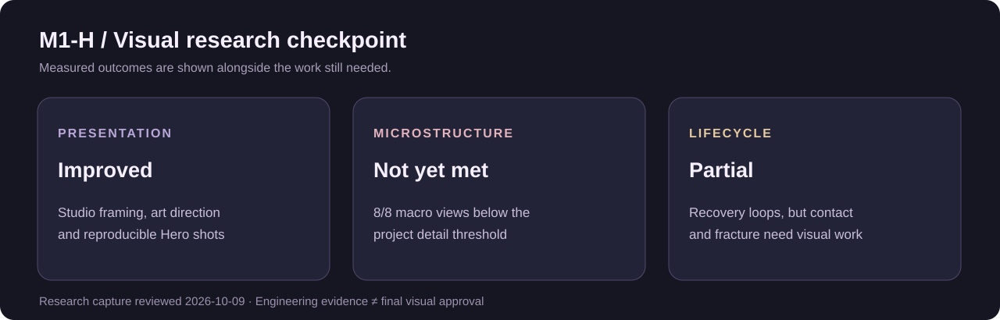
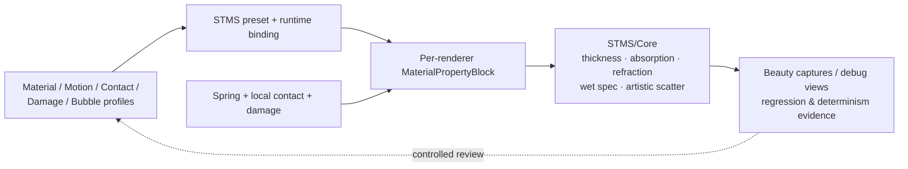

<strong>Soft, wet, light-carrying matter — engineered and art-directed in real time.</strong>

Unity / Tuanjie · URP 14.2 · Real-time rendering · Procedural materials · Soft-body interaction

Actual engine capture from the validated Jelly baseline. No synthetic Unity screenshots.

  <a href="#the-material">THE MATERIAL</a> ·
  <a href="#motion--interaction">MOTION</a> ·
  <a href="#material-identities">PRESETS</a> ·
  <a href="#m1-h--visual-research">M1-H REVIEW</a> ·
  <a href="#architecture--technical-evidence">ENGINEERING</a>

---

## An authored material, not a one-off effect

**STMS — Soft Translucent Material System** is a reusable technical-art research framework for expressing translucent, deformable matter with one shader core and a set of material, motion, damage, bubble and contact profiles.

> **Research question**  
> How can one real-time rendering and deformation architecture describe multiple soft, translucent subjects without building a separate shader for each one?

The first subject is a fruit / konjac jelly. The next subject, a jellyfish, is a separate **in-progress generalization test**, not a published validated visual result.

<table>
<tr>
<td width="50%" align="center"> <strong>01 / Internal structure</strong> Pulp, volume cues and bubbles inside a translucent shell</td>
<td width="50%" align="center"> <strong>02 / Optical study</strong> The same subject across controlled viewpoints</td>
</tr>
</table>

## The material

Thickness-driven absorption, screen-space refraction, Fresnel, artistic scattering and a wet highlight form the optical base. The art direction values *thick, coloured gel and light-transmitting edges*, rather than a polished glass ball.

<table>
<tr>
<td width="50%" align="center"> Analytic thickness debug</td>
<td width="50%" align="center"> Screen-space refraction check</td>
</tr>
</table>

These are authored approximations, **not** measured physical thickness, multi-layer refraction or a physical subsurface-scattering simulation.

## Motion & interaction

<strong>Recorded engine motion</strong> · spring wobble, overshoot and settle.

The framework includes drag, collision response, local contact, damage/recovery and visual fracture. However, M1-H's closer review found that **local finger contact is not yet convincing in the rendered picture**, even though pressure and contact parameters change. Motion implementation and visual readability are different acceptance tests.

## Material identities

Balanced Fruit · Clear Konjac · Cloud Jelly · Firm Clear Gel — shared architecture, authored profiles.

A single core provides different soft-material identities through ScriptableObject profiles and per-renderer material property blocks. Some identities remain too similar at Hero distance in greyscale; the showcase does not claim every preset is instantly distinguishable.

---

## M1-H / Visual research

**Latest reviewed checkpoint: M1-H — Jelly Final Art & Lifecycle, 2026-10-09.** The engineering capture and human-review package are complete; **final visual approval has not been granted**.

| Goal | What the tests actually established |
| --- | --- |
| Clean studio hero | Real captured and reproducible, awaiting artistic selection |
| Surface micro-detail | **Not met** — all 8 macro candidates missed the project-defined contrast gate |
| Interior appearance | **Needs polish** — pulp reads as separate blocks; bubbles often as flat rings |
| Local contact | **Visual limitation** — parameters move; many successive frames do not |
| Damage → Recovery | **Partial** — real animation and return-to-rest, weak transition readability |
| Soft fracture → Regeneration | **Partial** — one mesh, no true tear; transparency/sorting boundary remains |
| Formation / Growth | **Concept only, not accepted** — must not be described as a finished growth system |
| GPU performance | **Unmeasured** — CPU and synchronization measurements are not GPU times |

The M1-H review intentionally distinguished **successful reproducible captures** from **an approved final look**. See the [visual findings and next-step priorities](docs/m1h-visual-review.md).

> **Visual study disclosure**  
> The photographs above are selected *existing repository engine captures* and are preserved without beauty retouching. The new M1-H high-fidelity capture package is undergoing a separate provenance-preserving media sync; this page will show those specific frames only after the files themselves are published. The status text already reflects the M1-H evidence.

## Damage / fracture study

<table>
<tr>
<td width="50%" align="center"> Soft tear — single mesh, field-driven visual separation</td>
<td width="50%" align="center"> Partition · Seam · Regeneration debug channels</td>
</tr>
</table>

The effect does **not** split topology, make separate rigid pieces, or use FEM. The original first-glance tear target was not achieved under the current single-pass unsorted transparent shell constraints. This is a measured limitation, not an unreleased success.

## Architecture & technical evidence

**Engineering principles:** controlled candidate comparisons, stable evidence hashes, independent editor reruns, original-profile immutability, explicit technical limits. M1-H produced authentic 30-fps encoded sequences from 1/120-s simulation steps and captured renders — not generated intermediate frames.

**Open engineering issue:** the M1-H historical regression ran 19/19 collectors without C#/shader errors, yet **66 locked rendered files did not reproduce byte-identically**. They are not silently re-locked or declared passed.

**Current research tracks:**
- **Jelly:** M0–M1-G capabilities established; M1-H final-art review shows explicit visual gaps.
- **Jellyfish / M2-A:** second-subject generalization is in progress; no final validated result is claimed on this page.
- **Jelly Island × Water:** concept direction only. Integration readiness is **not met**; scale-aware thickness, transparency authority, runtime binding, assembly boundaries and GPU timing remain prerequisites.

Read more: [Technical breakdown](docs/technical-overview.md) · [Milestone status](docs/status.md) · [M1-H visual review](docs/m1h-visual-review.md) · [Media attribution](docs/media-attribution.md).

---

<strong>STMS / Technical Art R&amp;D</strong> One shader core · authored identities · measurable evidence · visible limitations

**Distribution:** public showcase and selected renders only. The Unity/Tuanjie project files, source assets, private evidence archives and third-party content are not redistributed. No open-source license is granted to the engine project. Tested context: Tuanjie 2022.3.62t16 / URP 14.2.0-t1.
