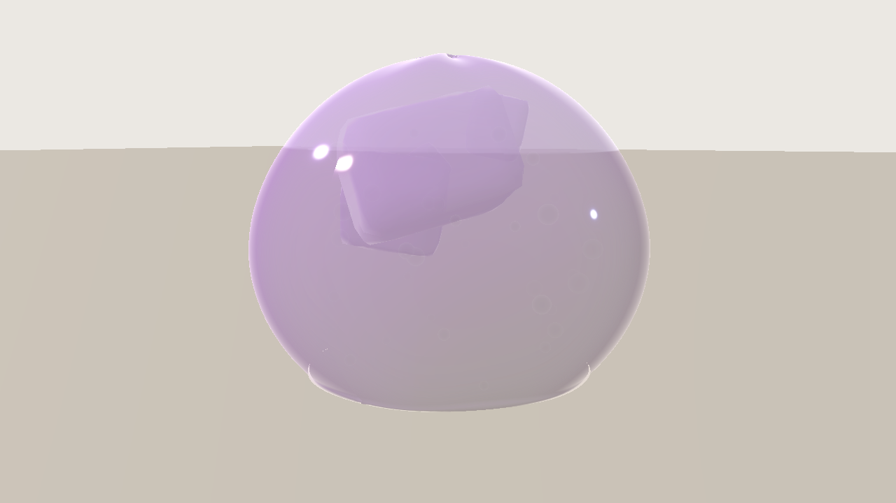
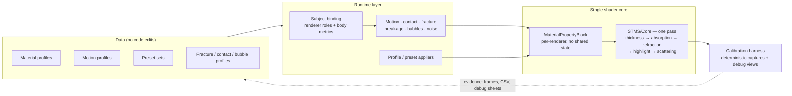
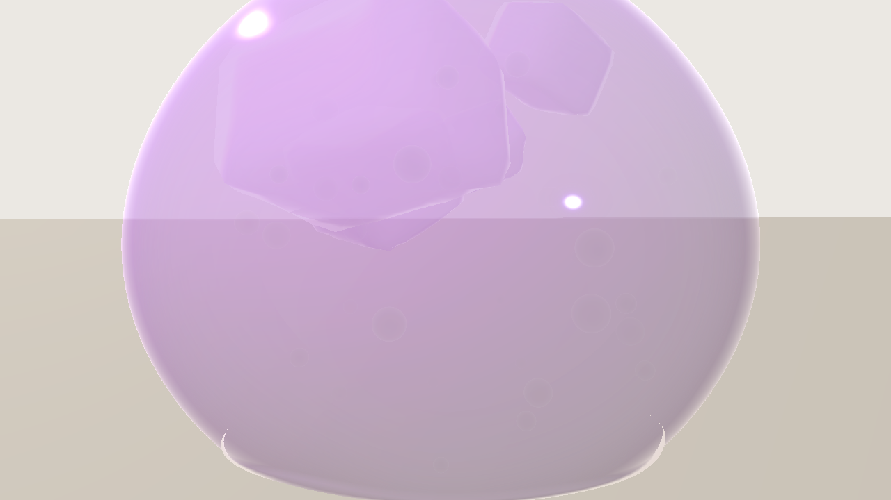
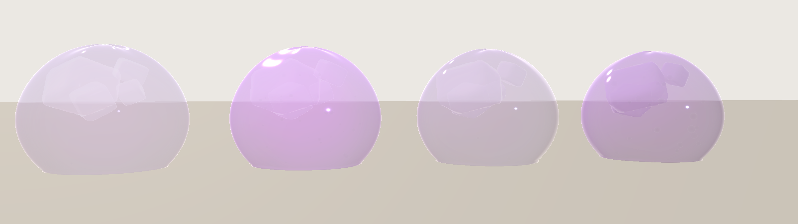
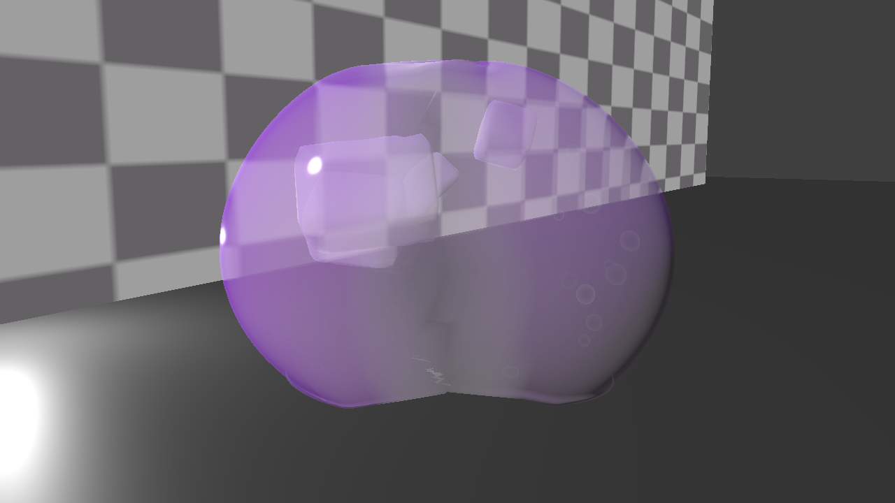
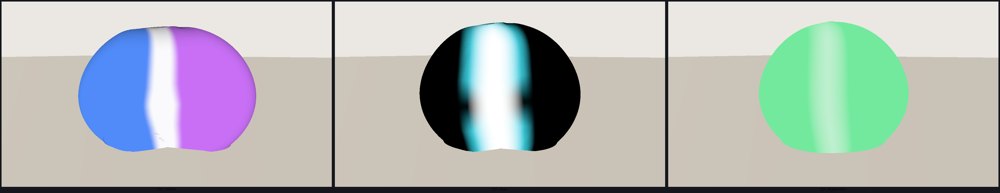

# SoftMatter / STMS

**Soft Material · Technical Art · Real-time Rendering Research System** — Tuanjie / Unity URP

*软半透明材质的可复用实时渲染与形变研究系统。*

  

STMS asks one research question: **can a single real-time translucent-material system describe soft, wet, light-carrying matter across different subjects** — instead of hand-tuning one shader for one look?

The system is built around a single shader core plus data-driven profiles, and every visual claim is backed by a reproducible calibration capture: deterministic frame sets, debug channels, and regression runs in independent editor processes. The konjac jelly is the validated baseline case study; the current research step is generalizing the same system to a structurally different second subject (jellyfish).

**Status: research prototype, actively developed.** Verified capabilities and open work are separated below, and approximations are named rather than hidden.

---

## Capability status

| Capability | Status | What the evidence covers |
| --- | --- | --- |
| Single-pass translucent optical core | **Verified** | Absorption / refraction / highlight / scattering calibrated against debug views and multi-view captures |
| Beer–Lambert absorption | **Verified** | Parameter sweep captures, per-material authored transmittance |
| Screen-space refraction | **Verified · bounded** | Checker calibration frames; cannot reconstruct off-screen data or inter-transparent refraction |
| Analytic thickness proxy | **Partial** | Correct for convex closed bodies and closed tubes; not a measured optical path |
| Artistic back-scattering | **Verified · approximation** | Reads as soft translucent matter; **not** physical subsurface scattering |
| Spring whole-body motion | **Verified** | Deterministic oscillator, damped-sweep curves, recorded motion captures |
| Drag / collision interaction | **Verified** | Grab, drag, overshoot, settle sequence captures |
| Local contact deformation | **Verified** | Directional dent + surrounding bulge, containment checks |
| Damage / recovery lifecycle | **Verified** | Press → damage → recovery timeline with per-frame CSV |
| Visual soft tear + regeneration | **Verified** | Canonical fracture profile: necking, seam, two-lobe visual separation, closing |
| Soft-tear first-glance readability | **Failed · parked** | Measured target not met on the broken frame; kept as a documented limitation, not silently fixed |
| Material / Motion profile + preset system | **Verified** | Four authored presets, identity comparison, runtime re-apply regression |
| Subject binding (renderer roles, per-renderer body metrics) | **Partial** | Implemented and regression-proven *not to change* existing behaviour; positive path on a second subject still untested |
| Multi-renderer look application | **Partial** | Motion / contact / fracture already drive 5–8 renderers; preset look still resolves one renderer |
| Jellyfish bell geometry | **Unverified** | Generation code drafted locally; never imported, compiled, validated or rendered |
| Jellyfish tentacles / material / motion / capture | **Not started** | No code, no frames |
| Second-subject end-to-end generalization | **In progress** | The actual goal of the current milestone |

*Verified = implemented plus a recorded acceptance run. Partial = implemented with a named untested path. Failed · parked = measured and rejected, deliberately not promoted.*

---

## Current system

Two structural rules make the system reusable: nothing is written to global shader state or shared materials, and every subsystem resolves its target renderers through one declaration instead of assuming a scene hierarchy. Both are what a second subject depends on.

---

## Latest milestone — M2-A: generalization foundation

**Research question:** can STMS represent a visually and structurally different soft translucent subject *without* creating a second shader core?

What this milestone has established so far:

- **The optical, motion, preset and fracture models are reusable as-is.** A closed bell plus closed tube tentacles can be fed through the existing core; the tentacle shape is even the analytically favourable case for the thickness proxy.
- **An explicit subject-binding layer is implemented.** Renderers now declare membership, role (primary shell / secondary tissue / internal / presentation-only) and optional per-renderer body metrics, replacing hierarchy guessing in motion, contact, fracture-role, breakage, bubble-field and internal-noise target resolution.
- **Regression evidence:** clean compile/import (0 C# errors, 0 shader errors, 0 exceptions), preset live re-apply with 0 failures across two independent processes, and the full fracture lifecycle gate passing — i.e. the binding is proven *inert* for the existing subject.

What it has **not** established: any jellyfish visual result. No jellyfish frame has ever been captured, and the bell generation code has not been through a compile or geometry-validation pass yet. That work is deliberately excluded from the published evidence set until it clears the same gates as the jelly.

Three limitations are recorded rather than designed away: transparent siblings cannot refract each other in a single screen-space pass; the motion anchor model assumes a floor-contact body; internal structure volumes are spherical and origin-centred.

---

## Material and optical model

Thickness is estimated analytically from view-dependent geometry, then drives Beer–Lambert transmittance; refraction samples the captured opaque scene colour; a wet highlight and an artistic back-scatter term carry the read at a glance.

<table>
  <tr>
    <td width="50%"></td>
    <td width="50%"></td>
  </tr>
  <tr>
    <td align="center">Analytic thickness proxy — brighter centre, thinner rim</td>
    <td align="center">Screen-space refraction against a procedural checker</td>
  </tr>
</table>

**Approximation boundary:** thickness is a proxy, not a measured path length. Refraction is screen-space, not physically correct inter-refraction. Scattering is artistic, not subsurface scattering.

## Internal structure and authored identity

The same core carries internal detail: suspended pulp chunks, a volumetric bubble field and low-frequency internal noise, each authored per material rather than baked.

  

Presets package material, motion, contact, breakage, noise and bubble profiles into switchable identities. Four authored presets, same geometry and lighting, no per-preset code:

  

## Motion and interaction

A damped spring integrates displacement and lean per frame; local contact adds a directional dent with a surrounding bulge that composes with whole-body motion. Recorded capture, medium profile:

  

## Damage and recovery

Damage drives a lifecycle on the *same* mesh: necking, a seam channel, two-lobe visual separation and regeneration. The canonical profile is the one shown; the debug sheet exposes the three channels that drive it.

<table>
  <tr>
    <td width="50%"></td>
    <td width="50%"></td>
  </tr>
  <tr>
    <td align="center">Soft tear, canonical profile</td>
    <td align="center">Partition / seam / regeneration debug channels</td>
  </tr>
</table>

**Accuracy boundary:** visual tear is deformation and shading driven. It does not create new mesh topology, independent physical fragments, or FEM soft-body behaviour.

---

## Validated baseline — the jelly case study

The konjac jelly is where each layer was calibrated and accepted, and it remains the reference subject: multi-view optical study, ground-truth comparison against real food jelly, and the regression baseline every later change is checked against.

  

Further calibration and regression frames — including the laboratory capture used for sorting and geometry checks — are described in [Technical overview](docs/technical-overview.md).

---

## Current limitations

- Scattering is an artistic approximation, **not** physical SSS.
- Thickness is an analytic proxy for convex closed bodies, **not** a measured optical path.
- Refraction is screen-space: no off-screen reconstruction, no inter-transparent refraction.
- Soft tear is visual separation on one mesh, **not** topology fracture.
- Motion is a tuned spring oscillator, **not** FEM or continuum soft-body simulation.
- The wobble anchor assumes a floor-contact body; a floating subject currently reduces lean to near-rigid translation.
- Internal structure volumes are spherical and origin-centred.
- Preset look application resolves a single renderer, so a multi-part subject cannot yet be repainted as one.
- No GPU benchmark is claimed. The only recorded numbers are preset apply-cost samples; the cost of the new binding layer is deliberately not attributed until the same revision is measured with it present and absent.
- The first fully validated subject is still the jelly; second-subject validation is the open research step.

## Next research step

1. Compile and geometry-validate the closed bell (winding proven by signed volume, split normals at the rim) with debug captures.
2. Add closed tube tentacles and subject-specific material / motion profiles.
3. Exercise the subject binding on the positive path: roles, per-renderer metrics, containment of a multi-part subject.
4. Extend preset look application across the declared renderer set without regressing the locked jelly evidence.
5. Capture and review a jellyfish frame — and only then promote it to the hero position.

## Distribution

Showcase only. This repository publishes selected documentation and rendered evidence; it does not distribute the engine project, source, packages, build caches, logs, internal research archives, agent data or third-party assets. No open-source license is assigned to the project source.

Rendering context: **Tuanjie 2022.3.62t16 / Unity URP 14.2.0-t1**. Compatibility with other engine versions or graphics APIs is not claimed.

**Related:** [Current status](docs/status.md) · [Technical overview](docs/technical-overview.md) · [Media attribution](docs/media-attribution.md) · [Lilith — portfolio](https://github.com/lilith-techart)
