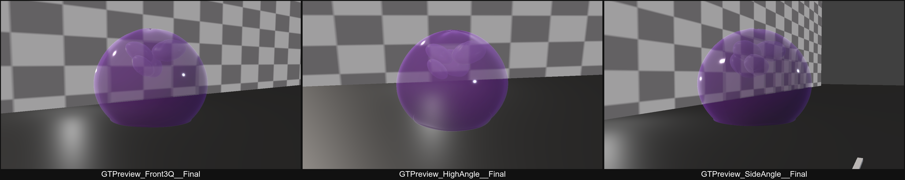
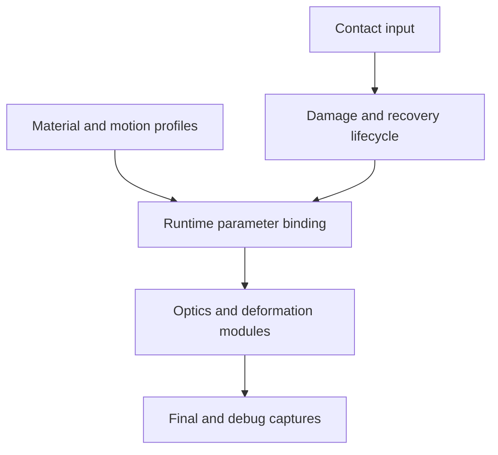

# SoftMatter / STMS

**Technical Art / Real-time Graphics / Interactive Media** · Unity URP

**Research Prototype / WIP** — 以紫色蒟蒻果冻为对象，研究半透明材质与软交互反馈。

## 要解决的问题

如何用同一套参数组织厚度、透光、湿润高光、运动与接触，让“软材质”既可解释又可迭代？本项目把材质线索与反馈拆成可比较的模块，以真实渲染捕获和 Debug 视图记录结果。

## Implemented

- Translucent jelly optical prototype：thickness proxy、Beer–Lambert absorption、screen-space refraction、wet highlight。
- Artistic back-scattering approximation，用艺术化背光近似增强软材质感。
- Spring motion、local contact deformation，以及单网格的 visual soft tear / regeneration。
- Profile / preset parameterization；材质与运动参数通过运行时绑定进入 Shader。

**边界**：scattering ≠ physical SSS；fracture ≠ topology fracture；fracture ≠ FEM physical simulation。厚度是解析代理，软撕裂是视觉表现。

## Results / Evidence

已有光学效果、厚度/折射和软撕裂 Debug 捕获，见 [技术拆解与图注](docs/technical-overview.md)。以下 GIF 只展示 spring-motion 实验，不把它当成完整撕裂或水母验证。

## WIP / Roadmap

**M2A generalization = WIP；jellyfish generalization 未完成。** 后续验证第二种主体的显式绑定、多个 renderer 的参数分发及光学/形变限制。

研究连接：将软硬、厚薄和恢复时序等视觉线索转化为可以观察、比较的交互与材质研究问题。此处是后续研究方向，不宣称已完成用户实验。

## Architecture / Pipeline

## Current Status / Distribution

[阶段状态与限制](docs/status.md) · [媒体来源与归属](docs/media-attribution.md)

Source/project distribution is not currently provided. 本仓库仅提供精选展示文档与真实技术截图，不包含 Unity 项目、源码包或可运行下载；本次没有指定开源许可证。

Rendering context: Tuanjie 2022.3.62t16 / Unity URP 14.2.0-t1。此处不承诺其他版本或图形 API 兼容。

[Lilith — Portfolio](https://github.com/lilith-techart)
