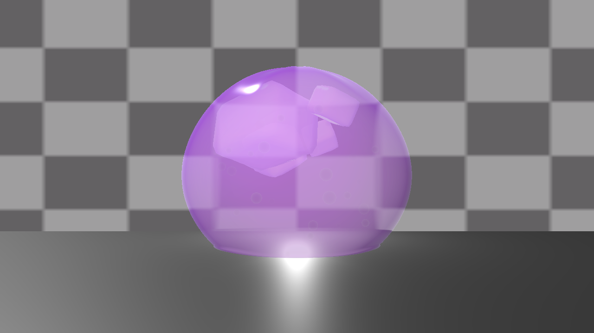

# STMS — 技术拆解

本页面向 TA / 实时渲染方向的审阅者，说明模块边界、近似发生在哪里、以及每个结论对应的证据类型。状态汇总见 [status.md](status.md)。

## 1. 光学模型：thickness → absorption → refraction

厚度使用**解析凸主体 proxy**（`pow(saturate(NdotV), power) * scale`，加常数偏置与 mask），让薄边与厚中心得到不同的透光响应；Beer–Lambert 用作者调校的 `sigmaA` 计算 transmittance；折射采样 `_CameraOpaqueTexture`，属于 screen-space。湿润高光与艺术化 back-scatter 负责一眼可读性。

<table>
  <tr>
    <td width="50%"></td>
    <td width="50%"></td>
  </tr>
  <tr>
    <td align="center">厚度代理通道：中心厚、边缘薄</td>
    <td align="center">棋盘折射校准帧（程序生成背景）</td>
  </tr>
</table>

近似位置（不是缺陷披露，是研究边界）：

- 厚度是 proxy，不是真实光程测量；对凸闭体与闭口管成立，对开放薄片不成立。
- screen-space 折射无法重建画面外信息，也无法让两个透明体互相折射（opaque texture 在透明队列之前捕获）。
- scattering 是艺术化项，**不是** physical SSS。
- 单一 pass、`Cull Back`、无两-sided normal：薄壁/开口组织需要额外处理。

## 2. 内部结构

同一 core 承载 pulp（独立 renderer 团块）、体积气泡场与低频内部噪声，全部按 material profile 授权，不写进 shader 常量。气泡场当前是**以 shell 原点为中心的球体**，这是记录在案的泛化边界。

  

## 3. Profile / Preset

Material Profile、Motion Profile、Contact、Breakage、Noise、Bubble、Fracture 等以 ScriptableObject 数据存在，preset 把它们打包为可切换身份；四个出厂 preset 在同一几何与灯光下比较：

  

结构约束：运行时不写 global shader state、不使用 `sharedMaterial` 修改、不产生可变 static；所有参数通过 per-renderer `MaterialPropertyBlock` 下发。这是"加第二个主体不会污染第一个主体"的前提。

## 4. 运动与局部交互

阻尼弹簧积分整体位移与 lean；局部接触层在接触点附近产生 dent 与周围 bulge，再与整体 wobble 组合。运动 anchor 模型假设身体坐在接触平面之上：anchor 以下不获得 lean，且会被拉回 anchor——因此悬空主体需要按 renderer 授权 anchor/height。

  

## 5. 损伤 / 恢复 / 软撕裂

同一网格上由 damage lifecycle 驱动 necking、seam 通道、双叶视觉分离与闭合再生。公开图为**canonical 撕裂 profile** 及其 partition / seam / regeneration debug 通道：

<table>
  <tr>
    <td width="50%"></td>
    <td width="50%"></td>
  </tr>
  <tr>
    <td align="center">软撕裂 canonical profile 帧</td>
    <td align="center">partition / seam / regeneration 通道</td>
  </tr>
</table>

未达成的目标同样记录：针对"一眼看出中央开口"的可读性优化做了参数扫描与量化测量，**没有任何候选达到目标**，canonical 参数因此保持不变，该子项状态为 FAIL（parked）。原因是未排序透明的渲染架构限制，而不是参数没调够。视觉撕裂 ≠ 拓扑断裂：不生成新拓扑、不生成独立物理碎片、不是 FEM。

## 6. M2-A：主体绑定与泛化

研究问题不是"做一个水母 shader"，而是现有架构能否在**不复制 shader core** 的前提下承载结构差异明显的第二主体。

当前证据：

- shader core、弹簧振子、Beer–Lambert、preset schema、MPB 下发路径可原样复用；
- 新增 subject declaration：renderer 成员、角色（primary shell / secondary tissue / internal / presentation-only）、可选 per-renderer body metrics；motion、contact、fracture-role、breakage、bubble、noise 的目标解析改为读取该声明，并保留旧路径 fallback；
- 独立 headless 进程回归：compile/import 0 错误、preset live re-apply 两轮 0 失败、fracture lifecycle gate `PASS`。

这一轮证明的是**绑定不改变既有主体行为**（inert）。它**没有**证明第二主体已经跑通：绑定的正向路径、多 renderer 的 preset look 应用（当前仍解析单个 renderer）都还是待验证项，所以公开状态是 PARTIAL 而不是 PASS。

水母本体：bell 生成代码只是本地草稿，未经编辑器导入/编译、无调用点、无几何验证；tentacle、材质、运动、capture 均未开始，**没有任何水母帧**。这些内容按证据纪律不进入公开成果。

## 7. 校准与验证方法

每个阶段以固定机位、固定灯光、独立进程重放采集：变体对照表、debug 通道图、逐帧 CSV、确定性（跨进程字节一致）与包含性检查。下图为实验室校准帧（棋盘背景 + 排序/几何检查用途），说明公开图并非"渲染一张好看的图"，而是可重放的验证流程：

  

## 8. 不宣称的内容

不宣称 GPU benchmark、physical SSS、topology fracture、FEM soft-body simulation、跨引擎兼容，也不把未编译或未通过 capture gate 的草稿当作已完成能力。
